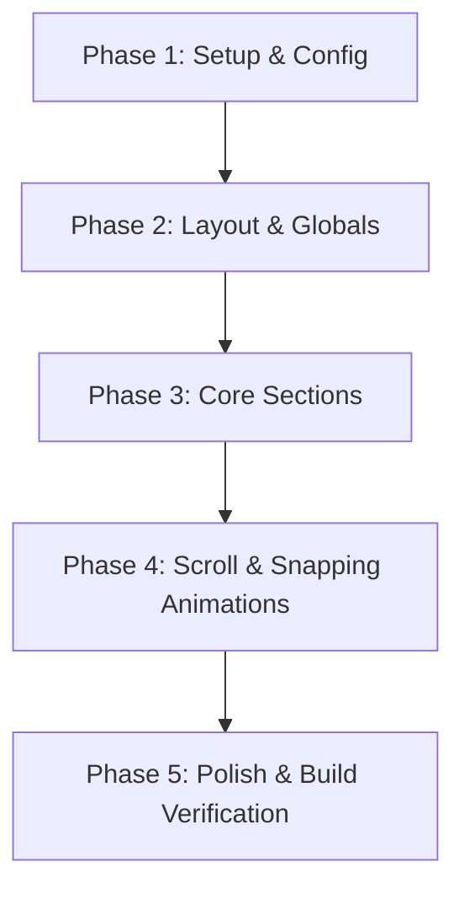

# Implementation Plan - Convert Portfolio to React.js

This plan outlines the strategy to convert the single-file portfolio (`main.html`) into a structured React.js application. We will break down the monolithic HTML file into reusable, modular React components, configure the styling (using Tailwind CSS configured to match the HTML's custom configuration), and set up the interactive animations using GSAP and React state.

## User Review Required

We plan to initialize this as a React project using **Vite**. Vite is fast, modern, and has excellent support for React and Tailwind CSS.

> [!IMPORTANT]
> **Aesthetic & Interactive Continuity**
> The original portfolio relies on custom mouse tracking (`cursor: none`), radial gradient glow effects on hover, canvas particle animation (Matrix background), and custom scroll-driven GSAP snapping. We must ensure these features are fully translated to React using standard hooks (`useEffect`, `useRef`, `useState`) to avoid visual degradation.

## Project Configuration

Based on your preferences, the project will be constructed using the following stack:
1. **Framework**: React.js initialized via **Vite**.
2. **Styling**: Tailwind CSS (version 3 or latest) with custom styling and fonts.
3. **Animations**: Standard GSAP and ScrollTrigger, ensuring full visual and interactive parity with the original single-file portfolio.
4. **Package Manager**: **npm**.

---

## Proposed Changes

### Project Phases & Tasks

To execute this migration systematically, we have broken the work down into the following structured phases and tasks:



#### Phase 1: Project Initialization & Configuration
- [ ] **Task 1.1: Initialize React Project**
  - Create the Vite project layout with React.js.
- [ ] **Task 1.2: Dependency Configuration**
  - Install Tailwind CSS, PostCSS, Autoprefixer, GSAP, and package tools.
- [ ] **Task 1.3: Port Tailwind Theme Config**
  - Translate the tailwind.config settings from `main.html` (e.g. `colors`, `fontFamily`, `fontSize`, `spacing`) into `tailwind.config.js`.
- [ ] **Task 1.4: Base CSS Setup**
  - Set up global rules in `index.css` (custom cursor hides, custom fonts, scrollbar designs, base variables).

#### Phase 2: Global & Layout Primitives
- [ ] **Task 2.1: Implement Custom Cursor**
  - Create `CustomCursor.jsx` listening to document-level mouse positions with conditional class active states.
- [ ] **Task 2.2: Implement Canvas Particle Matrix**
  - Create `MatrixBackground.jsx` handling particle animations and canvas sizing.
- [ ] **Task 2.3: Build Header & Navbar Overlay**
  - Build `Navbar.jsx` with scroll height resize trigger, and `MenuOverlay.jsx` with links slide animations.
- [ ] **Task 2.4: Build TactileCard wrapper**
  - Build `TactileCard.jsx` to trace relative mouse positions on elements to drive radial gradient styles.

#### Phase 3: Core Page Sections
- [ ] **Task 3.1: Build Hero Section**
  - Port intro bios, tags, social links into `Hero.jsx`.
- [ ] **Task 3.2: Build Recognition Section**
  - Create `Recognition.jsx` containing honors, leadership cards, and creative arsenal tools.
- [ ] **Task 3.3: Build Interactive Stack Component**
  - Convert `Stack.jsx` with full state management (POP/PUSH lists) and animation states.
- [ ] **Task 3.4: Build Contact Footer Section**
  - Construct `Contact.jsx` footer featuring Email/Tel links and the signature spotlight mouse mask.

#### Phase 4: Scroll & Animations Integration
- [ ] **Task 4.1: Integrate Horizontal Work Scroller**
  - Implement `Work.jsx` hooking GSAP ScrollTrigger to capture vertical viewport scrolling and translate it into panel shifting.
- [ ] **Task 4.2: Scroll Reveal Mechanics**
  - Add simple viewport intersection hooks to trigger entrance scroll reveals on components.

#### Phase 5: Verification & Fine Tuning
- [ ] **Task 5.1: Build Verification**
  - Execute `npm run build` to verify there are no import, syntax, or typescript compiling issues.
  - Test transitions, hover states, and canvas interactions.

---

### Project Structure

We will create a clean and scalable React folder structure:

```
portfolio/
├── public/                 # Static assets
├── src/
│   ├── assets/             # Images, fonts, SVG icons
│   ├── components/         # Reusable structural components
│   │   ├── custom-cursor/  # Custom cursor tracker component
│   │   ├── background/     # Canvas matrix particle background
│   │   ├── layout/         # Header, Navbar, MenuOverlay
│   │   ├── sections/       # Main portfolio sections
│   │   │   ├── Hero.jsx
│   │   │   ├── Work.jsx
│   │   │   ├── Recognition.jsx
│   │   │   ├── Stack.jsx
│   │   │   └── Contact.jsx
│   │   └── ui/             # Generic ui elements (e.g., TactileCard)
│   ├── index.css           # Global custom classes & Tailwind imports
│   ├── App.jsx             # Main application assembler
│   └── main.jsx            # React root entrypoint
├── tailwind.config.js      # Custom theme settings ported from HTML script
├── postcss.config.js       # PostCSS helper config
├── vite.config.js          # Vite custom config
└── package.json            # Scripts and dependencies (react, tailwindcss, gsap, etc.)
```

---

### Component Breakdown

#### [NEW] [CustomCursor.jsx](file:///Users/gurlalsingh/Desktop/portfolio/src/components/custom-cursor/CustomCursor.jsx)
- Listens to global `mousemove` events.
- Synchronizes a custom cursor `div` with the cursor position.
- Uses dynamic status checks to apply the `.cursor-active` state when hovering over links, buttons, cards, and stack items.

#### [NEW] [MatrixBackground.jsx](file:///Users/gurlalsingh/Desktop/portfolio/src/components/background/MatrixBackground.jsx)
- Renders a `<canvas>` element filling the screen background.
- Emulates the custom particle logic: text words dropping vertically with mouse repulsion.
- Written cleanly with React's `useRef` and `useEffect` hooks for resource cleanup on unmount.

#### [NEW] [Navbar.jsx](file:///Users/gurlalsingh/Desktop/portfolio/src/components/layout/Navbar.jsx)
- Top navigation bar.
- Dynamically resizes from `h-20` to `h-16` on scroll using react hooks (`useState` and `useEffect` scroll listeners).
- Emits action to toggle the menu overlay.

#### [NEW] [MenuOverlay.jsx](file:///Users/gurlalsingh/Desktop/portfolio/src/components/layout/MenuOverlay.jsx)
- Fullscreen hamburger overlay menu.
- Uses GSAP transitions on mount/unmount to animate links gracefully.

#### [NEW] [TactileCard.jsx](file:///Users/gurlalsingh/Desktop/portfolio/src/components/ui/TactileCard.jsx)
- Reusable wrapper component for the glassmorphism grid elements.
- Handles mousemove events to track cursor delta coordinates relative to the card's bounding rect.
- Updates custom CSS variables `--x` and `--y` on the component's style attribute to render the hover glow radial gradient.

#### [NEW] [Hero.jsx](file:///Users/gurlalsingh/Desktop/portfolio/src/components/sections/Hero.jsx)
- Translates structural elements of the header section, intro bios, external links (GitHub, LinkedIn, Resume), and status flags.

#### [NEW] [Work.jsx](file:///Users/gurlalsingh/Desktop/portfolio/src/components/sections/Work.jsx)
- Implements the horizontal scroll panel layout.
- Utilizes GSAP `ScrollTrigger` pin/snap mechanics to bind panels to viewport scroll triggers.
- Modularized to render individual sub-components representing projects.

#### [NEW] [Recognition.jsx](file:///Users/gurlalsingh/Desktop/portfolio/src/components/sections/Recognition.jsx)
- Grid container displaying achievements: Honors & Awards, Leadership, and Creative Arsenal.
- Utilizes the custom `TactileCard` to maintain consistent glowing hover styling.

#### [NEW] [Stack.jsx](file:///Users/gurlalsingh/Desktop/portfolio/src/components/sections/Stack.jsx)
- Port of the interactive Push & Pop visual stack.
- Manages the arrays `mainStackState` and `poppedStackState` via React state variables.
- Uses CSS transitions and animations to handle items sliding in/out dynamically.

#### [NEW] [Contact.jsx](file:///Users/gurlalsingh/Desktop/portfolio/src/components/sections/Contact.jsx)
- Footer sections containing email/tel links.
- Emulates the signature spotlight hover mask effect (`KESHAV` text overlay matching mouse cursor coordinates).

---

### Configurations

#### [NEW] [tailwind.config.js](file:///Users/gurlalsingh/Desktop/portfolio/tailwind.config.js)
- Ports the extensive custom extend theme configurations (colors, margins, font sizes, spacing, and Syne/Geist/JetBrains font assignments).

#### [NEW] [index.css](file:///Users/gurlalsingh/Desktop/portfolio/src/index.css)
- Imports Tailwind directives.
- Imports custom Google fonts.
- Houses custom cursor hide directives (`cursor: none`), customized scrollbar styles, and specific CSS transitions.

---

## Verification Plan

### Automated Tests
- Once files are structured, we will run build verification (`npm run build` or `vite build`) to check for compilation/bundling issues.

### Manual Verification
- Deploy a local development server using `npm run dev` and visually verify:
  1. Responsive grid layout.
  2. Snapping horizontal scrolling of the work panels.
  3. Interactive canvas background repulsion.
  4. Cursor tracking & activation states.
  5. Push/Pop stack logic and animation state.
  6. Email signature spotlight mask tracking.
